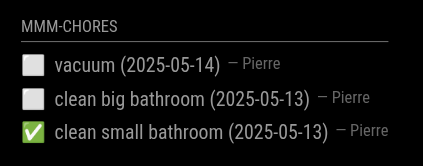
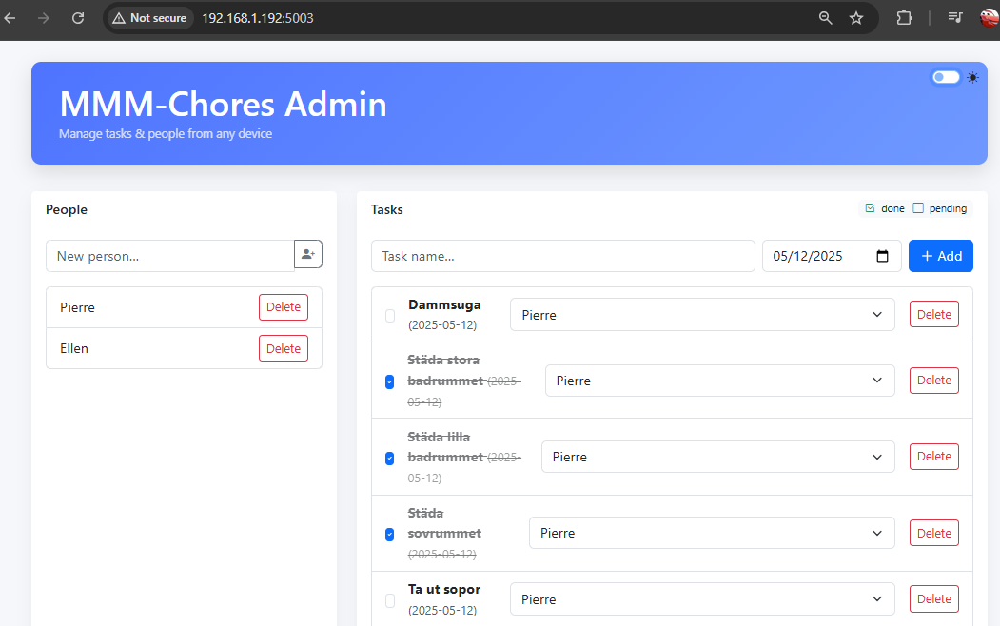
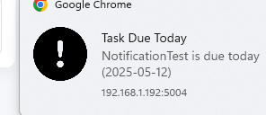

# MMM-Chores

**MMM-Chores** is a module for [MagicMirror²](https://github.com/MagicMirrorOrg/MagicMirror) that allows you to manage your household chores.

It provides an admin interface where you can add, edit, and delete tasks. You can also set due dates and assign tasks to different persons. The module displays the tasks on your MagicMirror, allowing you to keep track of your household chores at a glance.

The data is stored in `data.json` to make the data persistent between restarts.

## Screenshots
  




## Installation

```bash
cd ~/MagicMirror/modules
git clone https://github.com/PierreGode/MMM-Chores
cd MMM-Chores
npm install
```

## Update

```bash
cd ~/MagicMirror/modules/MMM-Chores
git pull
npm install
```

## Configuration

```js
  {
    module: "MMM-Chores",
    position: "top_left",
    header: "Chores",
    config: {
      updateInterval: 60 * 1000,
      adminPort: 5003,
      showDays: 3,  // show tasks dated today, tomorrow, and the day after
      showPast: true   // also show unfinished tasks from past days
    }
  },
```

## Admin Interface

Go to http://yourmirrorIP:5003/ #page will be reachable within same network.
> [!CAUTION]
> DO NOT expose application with portforward

## Push Notifications

If you wish to use push notifications follow guide below. 



### 1. in MagicMirror/modules/MMM-Chores create a folder certs

```bash
mkdir MagicMirror/modules/MMM-Chores/certs
```

### 2. Generate a private key in MMM-Chores/certs

```bash
openssl genrsa -out server.key 2048
```

### 3. Create a certificate signing request (CSR)

```bash
openssl req -new -key server.key -out server.csr -subj "/C=SE/ST=Stockholm/L=Stockholm/O=Home/CN=192.168.1.192" <--- YOUR IP
```

### 4. Generate a self-signed cert valid for 1 year

```bash
openssl x509 -req -in server.csr -signkey server.key -out server.crt -days 365
```

copy /certs/server.crt and install on your devices.

browse to https://yourmirrorIP:5004/ and allow push notifications.

> [!NOTE]
> And yes everything will yell unsafe, warning warning, Not Secure, that is what happens when you do a selfsigned certificate and not a micrsoft signed cert for loads of money ;P

